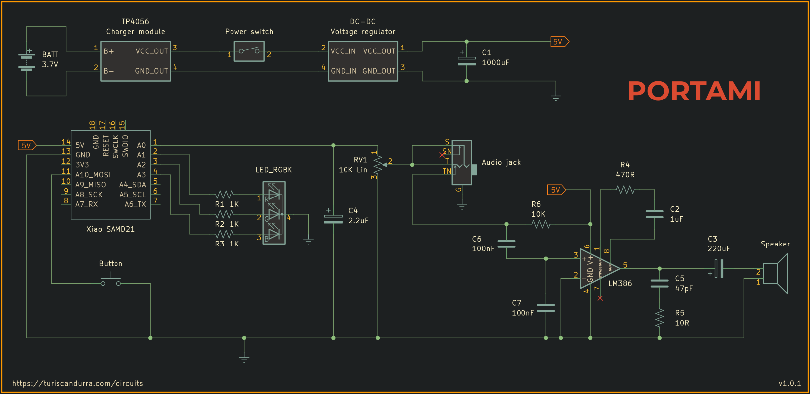

# Portami
## Portable USB Midi synth with onboard speaker and audio out

See it in action: [YouTube video](https://youtu.be/IseTEVhyauk)

Portami is a portable, battery-powered polyphonic synth built around a SAMD21 microcontroller. It's designed to be a companion to small Midi keyboards.

The software is a fork of [Marcel Licence's excellent code](https://github.com/marcel-licence/samd21_mini_synth).

My implementation focuses on USB Midi communication (Midi-in through the onboard USB-C port) and features a push button to cycle between wave types (sine, saw, square, pulse, triangle, and noise). An RGB led inside the button changes color according to the current wave type.

It should work out-of-the-box with basic keyboard controllers, like the AKAI LPK25 in the picture. Knobs can be mapped to change synth parameters like modulation speed or pitch bend range. I tested it with an AKAI MPK Mini Play, and a keyboard mapping for this specific controller is provided. There also is a debugging tool (SAMD21synthDebugger) that can be used to find the address of knobs and sliders of more controllers.

Other than the onboard speaker driven by an LM386 amplifier, Portami has a 3.5" mini-jack port to plug a pair of headphones. The audio socket has a switching mechanism, disconnecting the speaker when in use.

The whole setup is powered by a 3.7V, 1100mAh li-ion battery, recharged and protected by a TP4056 USB-C charger module. A regulator boosts voltage to 5V, providing power to the Midi keyboard (you might want to check current requirements for your specific setup, or power the keyboard externally).

### Required libraries
- [USB Host Library SAMD](https://github.com/gdsports/USB_Host_Library_SAMD)
- [Button](https://github.com/madleech/Button)

### BOM
- Seeed Studio XIAO SAMD21 (Seeeduino XIAO)
- TP4056 battery charger module
- 18650 or equivalent lithium battery
- Voltage regulator (like boost converter MT3608)
- LM386 audio power amplifier IC
- 47pF capacitor
- 2x 100nF capacitors
- 1uF capacitor
- 2.2uF electrolytic capacitor
- 220uF electrolytic capacitor
- 1000uF electrolytic capacitor
- 10Ω resistor
- 470Ω resistor
- 3x 1K resistors
- 10K resistor
- RGB LED
- 10K linear potentiometer
- 8Ω speaker
- A push-button switch (momentary)
- A rocker or latching switch

### Schematic

The word portami in Italian means "take me" (to a location). As in "portami con te" (take me with you).

Project notes and more info at [turiscandurra.com/circuits](https://turiscandurra.com/circuits)